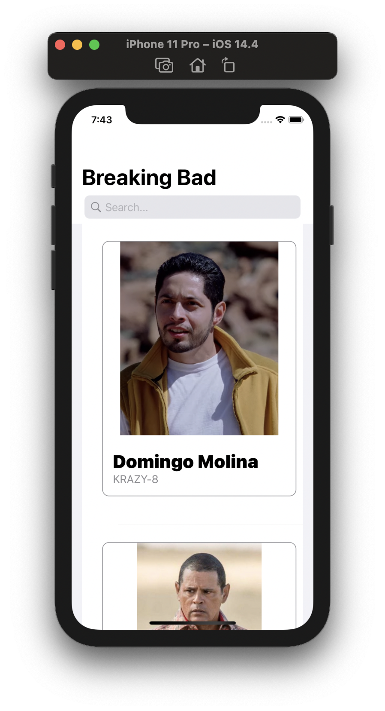
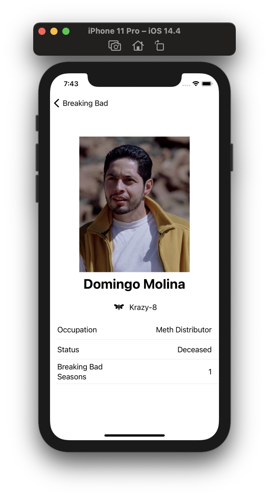
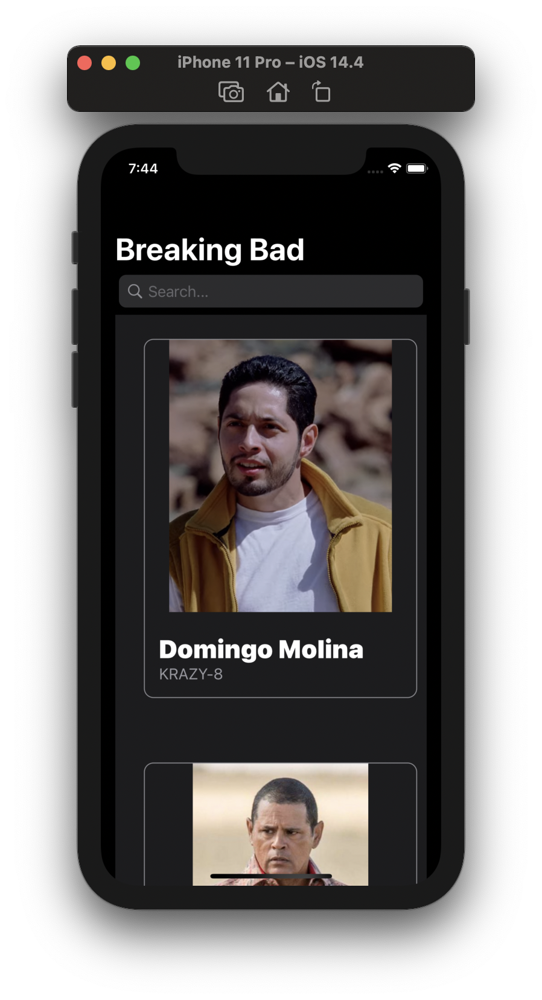
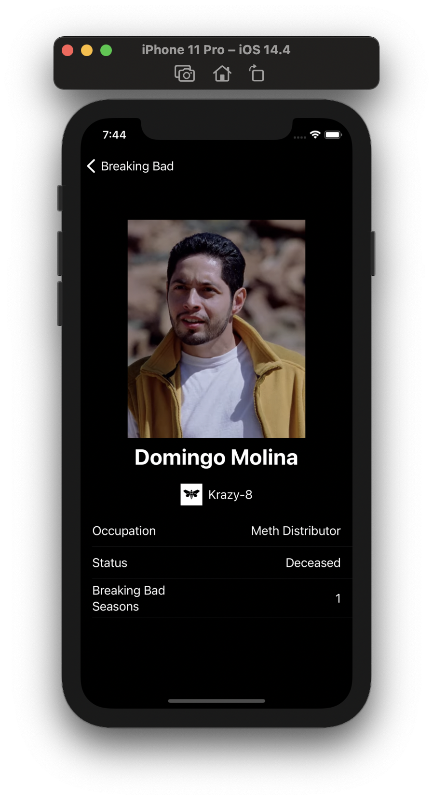
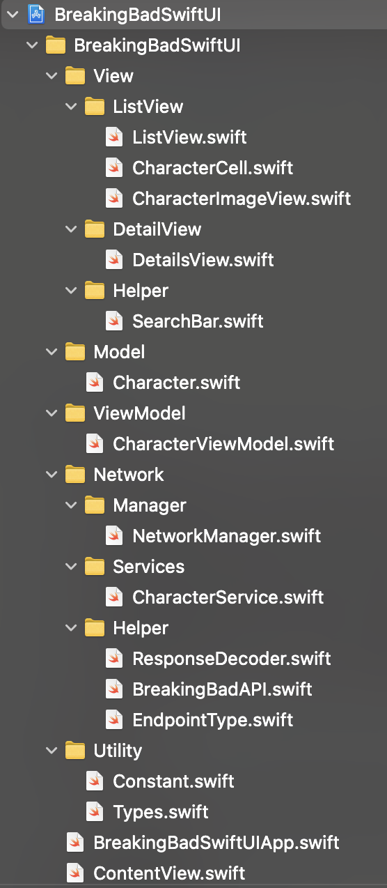

# BreakingBadSwiftUI

## Table of contents
* [Introduction](#introduction)
* [Application Screens](#application-screens)
* [Features](#features)
* [Software And Technologies](#software-and-technologies)
* [Setup](#setup)
* [Approach](#approach)
* [Code Structure And Design Pattern](#code-structure-and-design-pattern)
* [Unit Testing](#unit-testing)
* [Future Features And Improvements](#future-features-and-improvements)

## Introduction:
iOS application to fetch and display a list of Breaking Bad series characters from the given endpoint, built with a combination of Swift, SwiftUI.

## Application Screens:

## Features:
1.  Consumption of API (https://breakingbadapi.com/api/characters) to fetch the characters list. (URL Session, Codable)
2.  Create List view to display the Characters list fetched from API. (SwiftUI)
3.  Create Search bar to provide search functionality. (SwiftUI)
4.  Create Details screen to show the details of the selected character.
5.  Error handling throughout the application.
6.  Unit Testing and UI Testing using XCTest framework.
7.  Dark mode support.

## Software And Technologies:
* MacOS: Big Sur (11.0.1)
* XCode: 12.3
* Minimum iOS version: 14.0
* Swift: 5
* SwiftUI

## Setup:
To run this project, open the BreakingBadSwiftUI.xcodeproj in XCode and you should be able to run it on the desired simulator without any changes(iPhone).
You will need to configure your development team in the app target's **"Signing & Capabilities"** tab in order to run it on real device.

## Approach:
1.  On the launch of the app, fetch the character list from API endpoint, using **URL Session** data task.
2.  Create the Character Json object from API response data using **JSONDecoder**.
3.  Use **SwiftUI** to show the characters in  a List view.
4.  Allow user to select List item and show details of selected character in new view.
5.  Allow user to search through the character list.
6.  Show Errors using **Alert view** appropriately.
7.  **Protocols-Delegates**: Used protocols for notifying the controller about  data availability and errors if any.
8.  **Enum**: Used with **Tuple** cases, **generic** type for Success and Failure conditions.
9.  **Extensions**: Used for adding more functionality to class and modularizing the code.

## Code Structure And Design Pattern:

### View:
1.  **ContentView** – root view for the app.
2.  **ListView** – view responsible for showing the character list view.
3.  **CharacterCell** -  view responsible for creating the character list view cell.
4.  **CharacterImageView** -  view responsible for creating the character image view for each cell.
5.  **DetailsView** – view responsible for showing the selected character details.
6.  **SearchBar** – view responsible for showing the search bar to allow searching characters.

### Model:
1.  **Character** – model used for the character list json data.

### ViewModel:
1.  **CharacterViewModel** – viewModel responsible for managing the character list view data.

### Networking:
1.  **NetworkManager** - responsible for managing the network call to get the data from the API.
2.  **CharacterService** - responsible for managing the API service for character list data.
3.  **ResponseDecoder** -  JSON decoder to parse and create the response model using JSONDecoder.
4.  **EndpointType** - protocol to get the base url and path components.
5.  **CreditScoreAPI** - enum to specify APIs available for character list.

### Utility:
1.  **Constants** – responsible for maintaining the constants used in app.
2.  **Types** - contains enum types used in app to specify https method type and APIs result(success/failure).

### Other:
1.  **CharacterServiceDelegate** - protocol to notify when the data is available. (Notify Success or Failure)

## Unit Testing: 
Apples **XCTest framework** is used to write the unit tests and UI tests for the application.
Following image illustrates the **test coverage** of the project.

## Future Features And Improvements:
1.  Write more Unit Tests and UI test.
2.  Add more animations.

